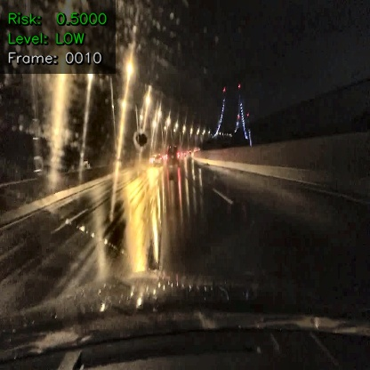
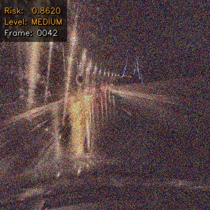
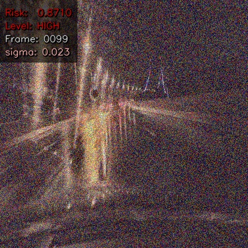
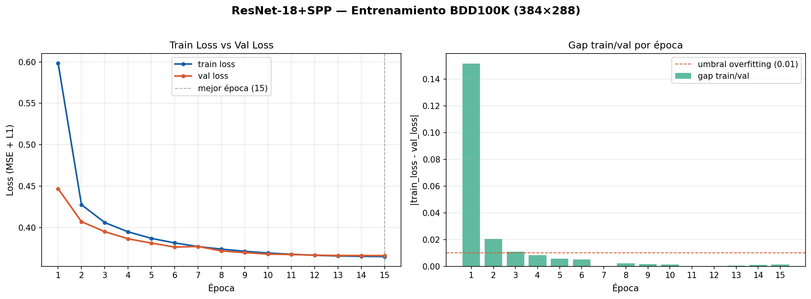
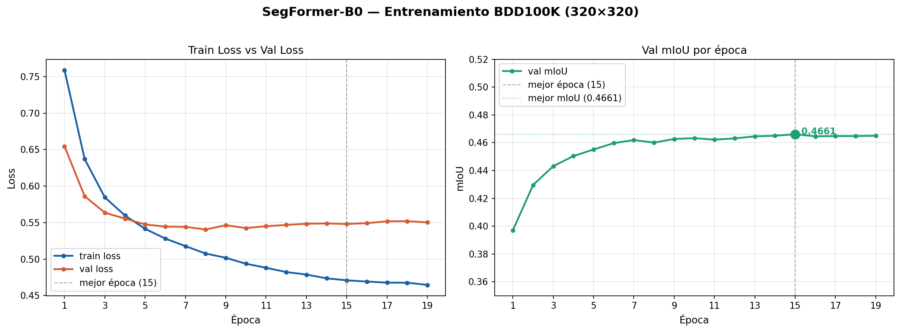
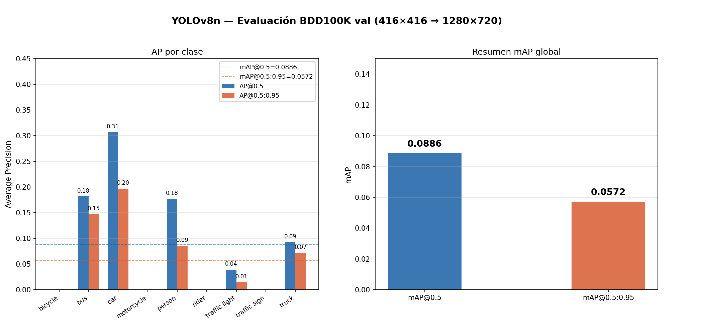
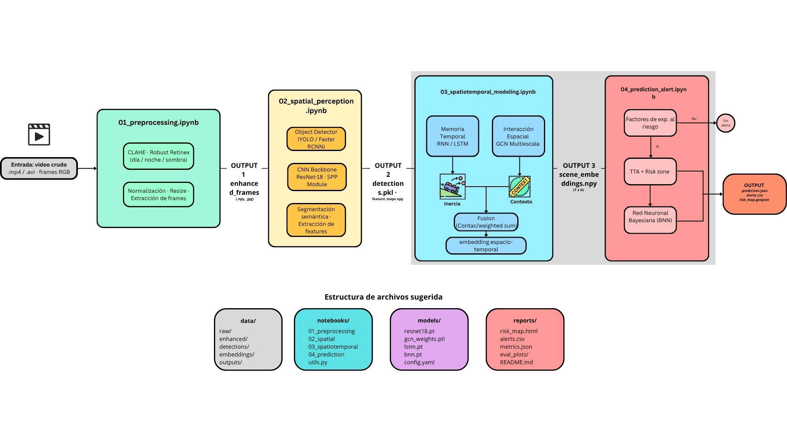

# Accident Detection System — Equipo 8
**Samsung Innovation Campus | Grupo 8 | SIC 2025**

Sistema de predicción de riesgo de accidente vial en tiempo real. Procesa video de conducción frame a frame mediante un pipeline de 5 etapas: preprocesamiento, percepción espacial, modelado espaciotemporal, predicción con incertidumbre y agente adaptativo de inferencia.

---

## Demo — Agente en Acción

### HUD de Riesgo (Overlay)

| Riesgo Bajo | Riesgo Medio | Riesgo Alto |
|:-----------:|:------------:|:-----------:|
|  |  |  |

### Videos del Pipeline Completo

> Carpeta completa en Google Drive: [resultados-estrategia1](https://drive.google.com/drive/folders/1viuKVvQLV4gm1kVVzpDMxW5oRigU8G0k?usp=sharing)

| Escena | Descripción |
|--------|-------------|
| `dia1_full.mp4` | Pipeline completo con HUD y alertas — escena diurna urbana |
| `DiaPeatones_full.mp4` | Pipeline completo — escena con peatones |
| `MedioDiaLluvia_full.mp4` | Pipeline completo — escena con lluvia al mediodía |
| `video_output.mp4` | Video de prueba del agente (inferencia corta) |

---

## Resultados de Entrenamiento

### Curvas de Entrenamiento

| ResNet18 + SPP | SegFormer-B0 |
|:--------------:|:------------:|
|  |  |

### Evaluación YOLO



### Métricas Finales

| Módulo | Modelo | Métrica | Valor |
|--------|--------|---------|-------|
| Percepción espacial | SegFormer-B0 | mIoU | 0.4661 |
| Percepción espacial | ResNet18+SPP | val_loss | 0.3661 |
| Percepción espacial | YOLOv8n | mAP@0.5 | 0.0886 |
| Preprocesamiento | BDD100K curado | imágenes 416×416 | 61,345 |

---

## Arquitectura del Pipeline



El agente implementa un **strategy pattern** adaptativo: según el nivel de riesgo activa más o menos modelos, balanceando precisión y latencia bajo restricción de 6 GB VRAM (GTX 1660 Ti).

| Nivel | Modelos activos | VRAM aprox. |
|-------|----------------|-------------|
| Bajo | YOLO + LSTM | ~0.8 GB |
| Medio | YOLO + SegFormer + LSTM | ~2.0 GB |
| Alto | YOLO + SegFormer + ResNet + GCN + LSTM + BNN | ~2.5 GB |

---

## Estructura del Repositorio

```
Equipo8-Grupo8-SIC-2025-/
├── assets/                              # Imágenes de resultados para el README
│   ├── overlay_test_low.jpg
│   ├── overlay_test_medium.jpg
│   ├── overlay_test_high.jpg
│   ├── resnet_training_curves.png
│   ├── segformer_training_curves.png
│   └── yolo_evaluation.png
├── notebooks/
│   ├── S1_data_engineering.ipynb        # Ingeniería de datos BDD100K
│   ├── 01_preprocessing.ipynb           # Pipeline CLAHE + curación 61,345 imgs
│   ├── 02_spatial_perception.ipynb      # YOLO · SegFormer · ResNet18+SPP
│   ├── 03_spatiotemporal_modeling.ipynb # GCNEncoder + RiskLSTM
│   ├── 04_prediction_alert.ipynb        # BNN con MC Dropout
│   ├── 05_agent.ipynb                   # Agente de inferencia en video
│   ├── convert_to_yolo_baseline.py      # Conversión etiquetas BDD→YOLO
│   ├── RESUMEN_PIPELINE.md              # Documentación técnica completa
│   └── src/
│       ├── model_manager.py             # Lazy loading + offloading VRAM
│       ├── perception.py                # Motor de percepción
│       ├── risk_estimator.py            # Estimación de riesgo
│       ├── overlay.py                   # Renderizado HUD
│       ├── alert_logger.py              # Logging CSV + JSON
│       └── agent_state.py              # Máquina de estados (histéresis)
├── requirements.txt
└── .gitignore
```

---

## Instalación

```bash
git clone https://github.com/Rogelio756/Equipo8-Grupo8-SIC-2025-.git
cd Equipo8-Grupo8-SIC-2025-
git checkout estrategia-1

python -m venv env_samsung
source env_samsung/bin/activate      # Linux/macOS
# .\env_samsung\Scripts\activate     # Windows

pip install -r requirements.txt
```

---

## Estado del Proyecto

| Etapa | Notebook | Estado |
|-------|----------|--------|
| Data Engineering | S1_data_engineering.ipynb | Completado |
| Preprocesamiento CLAHE | 01_preprocessing.ipynb | Completado |
| Percepción Espacial | 02_spatial_perception.ipynb | Completado |
| Modelado Espaciotemporal | 03_spatiotemporal_modeling.ipynb | Completado |
| Predicción con Incertidumbre | 04_prediction_alert.ipynb | Completado |
| Agente de Inferencia | 05_agent.ipynb | Completado |

---

## Autor

**Rogelio Leonardo Méndez Macías**
[](https://www.linkedin.com/in/rogelio-leonardo-mendez-macias/)

Equipo 8 — Grupo 8 | Samsung Innovation Campus 2025
