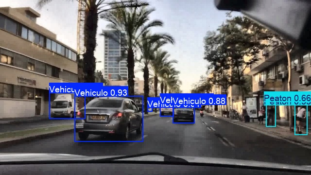
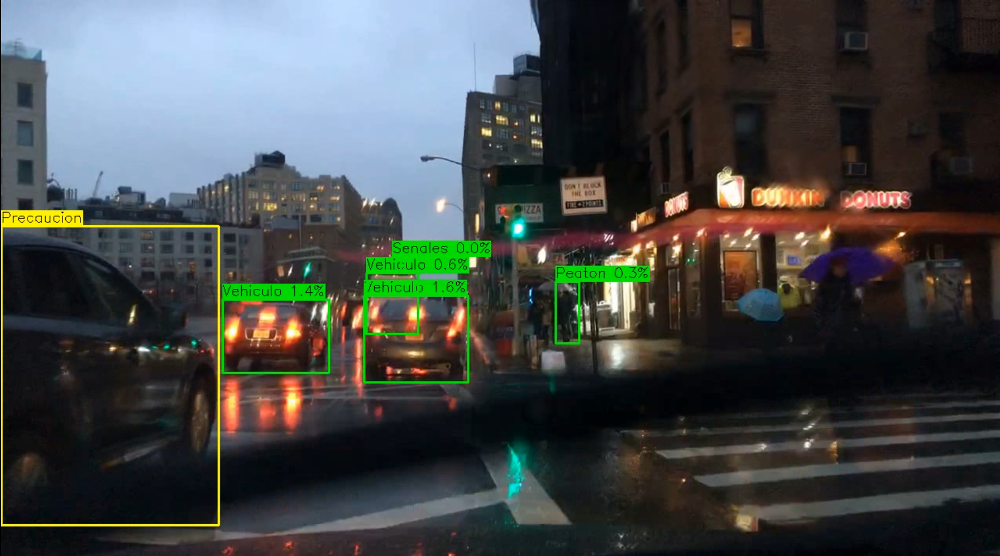
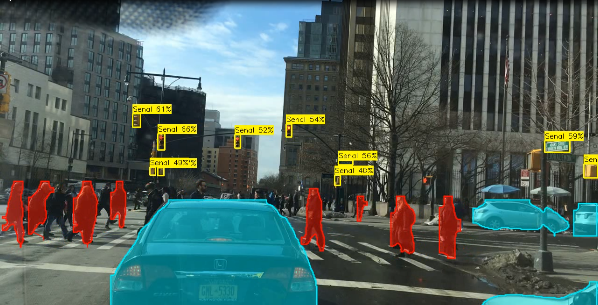
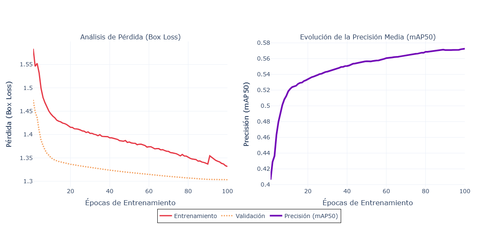
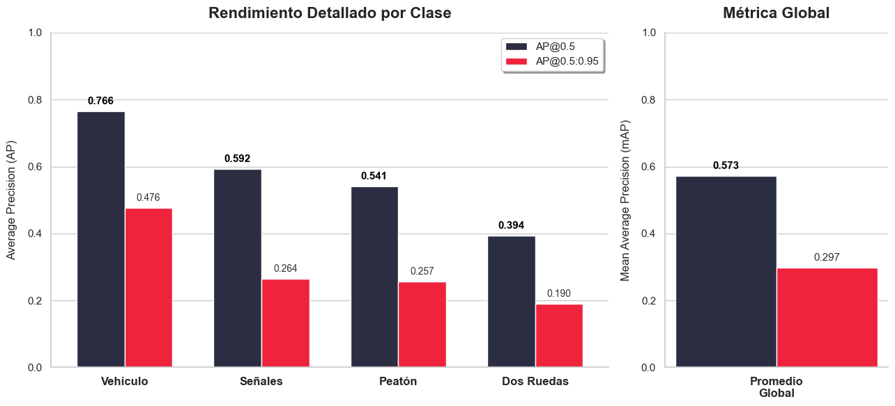
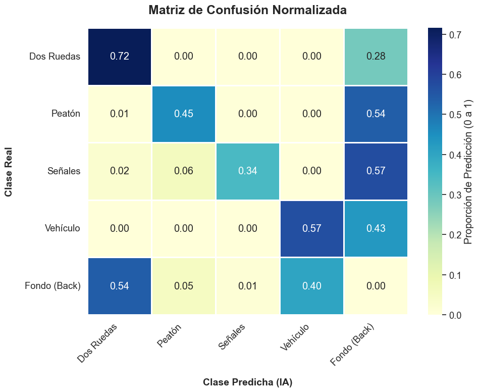

# Sistema de Asistencia a la Conducción (ADAS) — Equipo 8

**Samsung Innovation Campus | Grupo 8 | SIC 2025**

Sistema de prevención de colisiones en tiempo real. Este módulo implementa un pipeline híbrido Multi-Modelo de percepción visual acelerado por hardware, integrando detección de objetos especializada (YOLOv8n) y segmentación de instancias holográficas (YOLO-seg) con un motor de heurística espacial determinista.

---

## Demo — Agente Heurístico en Acción

### HUD de Telemetría (Overlay Alpha Blending)

|      Entorno de Prueba      |  Máscaras de Segmentación  | Detección Crítica y Alertas |
| :-------------------------: | :------------------------: | :-------------------------: | --- | --- |
|  |  |  |     |     |

### Entregables de Inferencia

> Los videos procesados a 30+ FPS se encuentran en el directorio de reportes.

| Archivo                 | Descripción                                                                                                        |
| ----------------------- | ------------------------------------------------------------------------------------------------------------------ |
| `video_hibrido_pro.mp4` | Video con Alpha Blending de máscaras (YOLO-seg), bounding boxes de señales (YOLOv8n) y HUD dinámico de telemetría. |
| `registro_alertas.csv`  | Registro asíncrono generado durante la inferencia con marca temporal, clases detectadas y niveles de riesgo.       |

---

## Resultados de Entrenamiento

El modelo base de percepción espacial (YOLOv8n) fue sometido a _fine-tuning_ sobre el dataset BDD100K preprocesado (~70,000 imágenes) utilizando una GPU NVIDIA RTX 4060.

### Curvas de Convergencia

### Evaluación de Precisión por Clase (mAP)

### Matriz de Confusión Normalizada

### Métricas Finales y Convergencia

| Modelo      | Épocas | Mejor Época | Métrica (mAP50) | Prevención de Overfitting         |
| ----------- | ------ | ----------- | --------------- | --------------------------------- |
| **YOLOv8n** | 100    | 82          | **0.573**       | Sí (_Early Stopping_ patience=15) |

_Nota técnica: El sistema demuestra una sensibilidad sobresaliente en vehículos (0.91) y peatones (0.90). El solapamiento morfológico observado entre vehículos de dos ruedas y peatones justifica la aplicación estricta de la heurística espacial para usuarios vulnerables._

---

## Arquitectura del Pipeline y Reglas de Negocio

El sistema no depende de estimación estéreo-visual, sino de un **Motor de Heurística Espacial** que calcula el área relativa de los _bounding boxes_ respecto a la resolución de la cámara, funcionando como un _proxy_ eficiente de proximidad.

El pipeline corre en precisión mixta (FP16) aprovechando _Tensor Cores_.

| Nivel de Riesgo | Condición de Área Visual          | Latencia Promedio | Rendimiento            |
| --------------- | --------------------------------- | ----------------- | ---------------------- |
| **BAJO**        | Vehículos < 8%, Vulnerables < 5%  | ~33 ms            | ~30+ FPS (Tiempo Real) |
| **MEDIO**       | Cualquier objeto > 8%             | ~33 ms            | ~30+ FPS (Tiempo Real) |
| **CRÍTICO**     | Vehículos > 15%, Vulnerables > 5% | ~33 ms            | ~30+ FPS (Tiempo Real) |

---

# 1. Clonar el repositorio

git clone [https://github.com/Rogelio756/Equipo8-Grupo8-SIC-2025-.git](https://github.com/Rogelio756/Equipo8-Grupo8-SIC-2025-.git)
cd Equipo8-Grupo8-SIC-2025-

# 2. Crear y activar entorno virtual

python -m venv env_samsung

# 3. Instalar dependencias clave

pip install ultralytics opencv-python pandas matplotlib seaborn plotly kaleido

# 4. Ejecutar el agente en video

python predict_video.py

---
